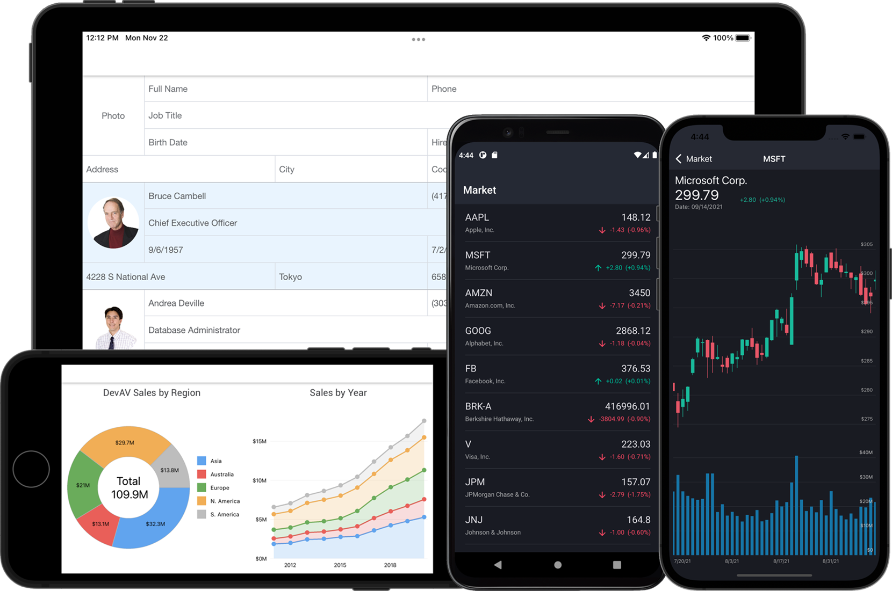

<!-- default badges list -->

<!-- default badges end -->
# DevExpress Collection View for .NET MAUI

[DevExpress Mobile UI](https://www.devexpress.com/maui/) allows you to use a .NET cross-platform UI toolkit and C# to build native apps for iOS and Android.

The **DevExpress Mobile UI for Xamarin.Forms and .NET MAUI** is free of charge. To learn more about our offer and to reserve your copy, visit [Free DevExpress Mobile UI for Xamarin.Forms and .NET MAUI](https://www.devexpress.com/xamarin-free).

## Requirements

Please register the DevExpress NuGet Gallery in Visual Studio to restore the NuGet packages used in this solution. See the following topic for more information: [Get Started with DevExpress Mobile UI for .NET MAUI](https://docs.devexpress.com/MAUI/403249/get-started).

## What's in This Repository

The **DevExpress Scheduler for .NET MAUI** display appointments (regular and recurrent planned events) and allows users to manage them.

This repository contains an example that demonstrates how to get started with the **DevExpress Scheduler for .NET MAUI**.

## Documentation

- [Scheduler](https://docs.devexpress.com/MAUI/403734/scheduler/index)
- [Data Grid](https://docs.devexpress.com/MAUI/403255/data-grid/data-grid)
- [Charts](https://docs.devexpress.com/MAUI/403300/charts/charts)
- [Data Form](https://docs.devexpress.com/MAUI/403640/data-form)
- [Navigation](https://docs.devexpress.com/MAUI/403297/navigation/index)
- [Data Editors](https://docs.devexpress.com/MAUI/403427/editors/index)
- [Collection View](https://docs.devexpress.com/MAUI/403324/collection-view/index)
- [Popup](http://docs.devexpress.devx/MAUI/403733/popup/index)

## More Examples

* [Stocks App](https://github.com/DevExpress-Examples/maui-stocks-mini)
* [Data Grid](https://github.com/DevExpress-Examples/maui-data-grid-get-started)
* [Data Form](https://github.com/DevExpress-Examples/maui-data-form-get-started)
* [Data Editors](https://github.com/DevExpress-Examples/maui-editors-get-started)
* [Pie Chart](https://github.com/DevExpress-Examples/maui-pie-chart-get-started)
* [Scatter Chart](https://github.com/DevExpress-Examples/maui-scatter-chart-get-started)
* [Tab Page](https://github.com/DevExpress-Examples/maui-tab-page-get-started)
* [Tab View](https://github.com/DevExpress-Examples/maui-tab-view-get-started)
* [Drawer Page](https://github.com/DevExpress-Examples/maui-drawer-page-get-started)
* [Drawer View](https://github.com/DevExpress-Examples/maui-drawer-view-get-started)
* [Collection View](https://github.com/DevExpress-Examples/maui-collection-view-get-started)
* [Popup](https://github.com/DevExpress-Examples/maui-popup-get-started)